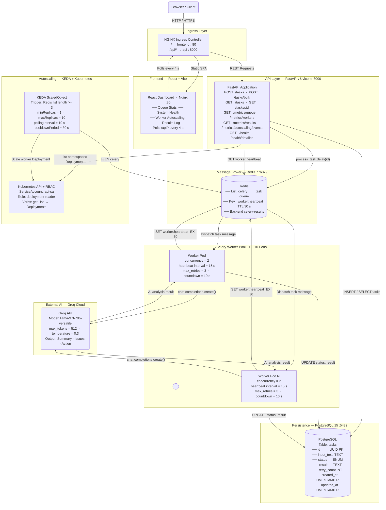
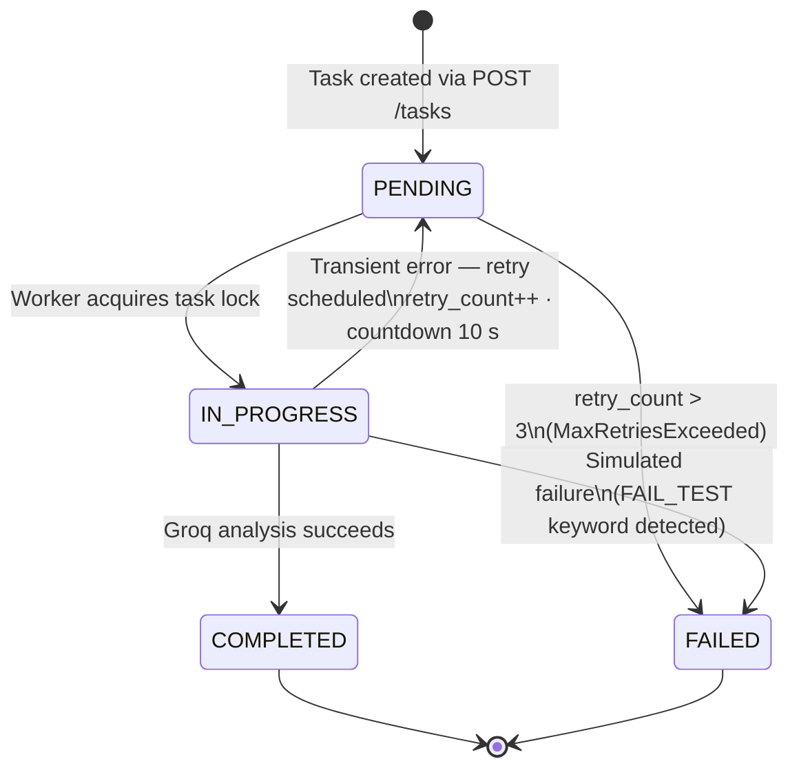
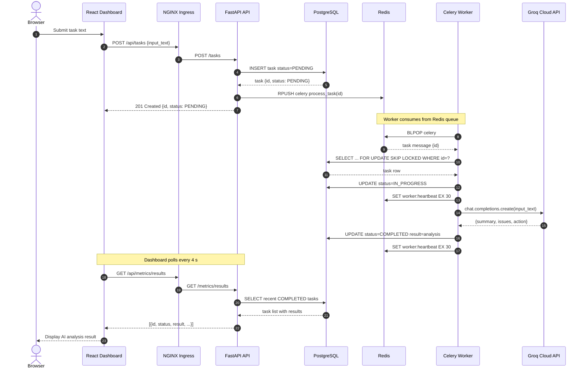
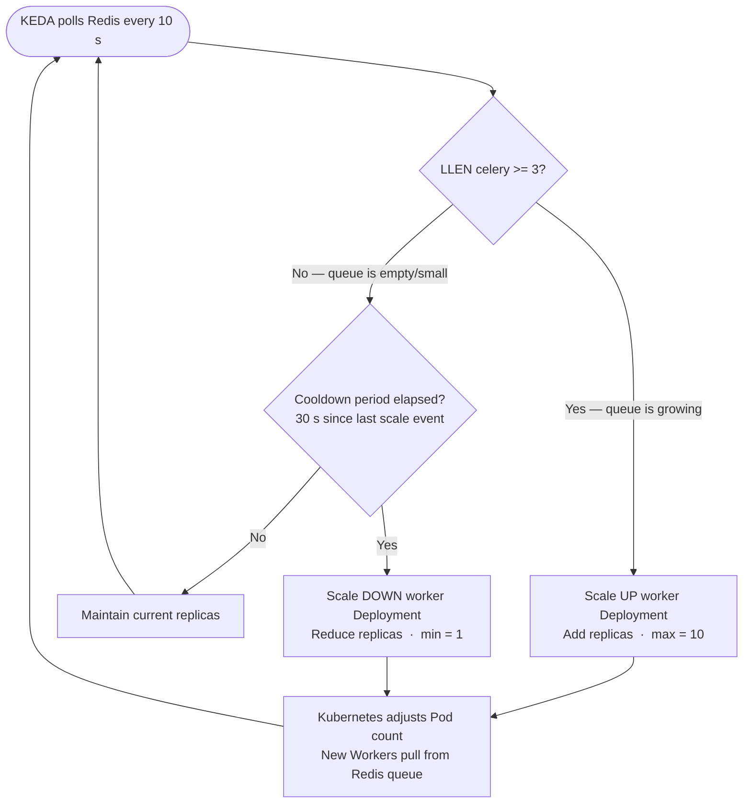
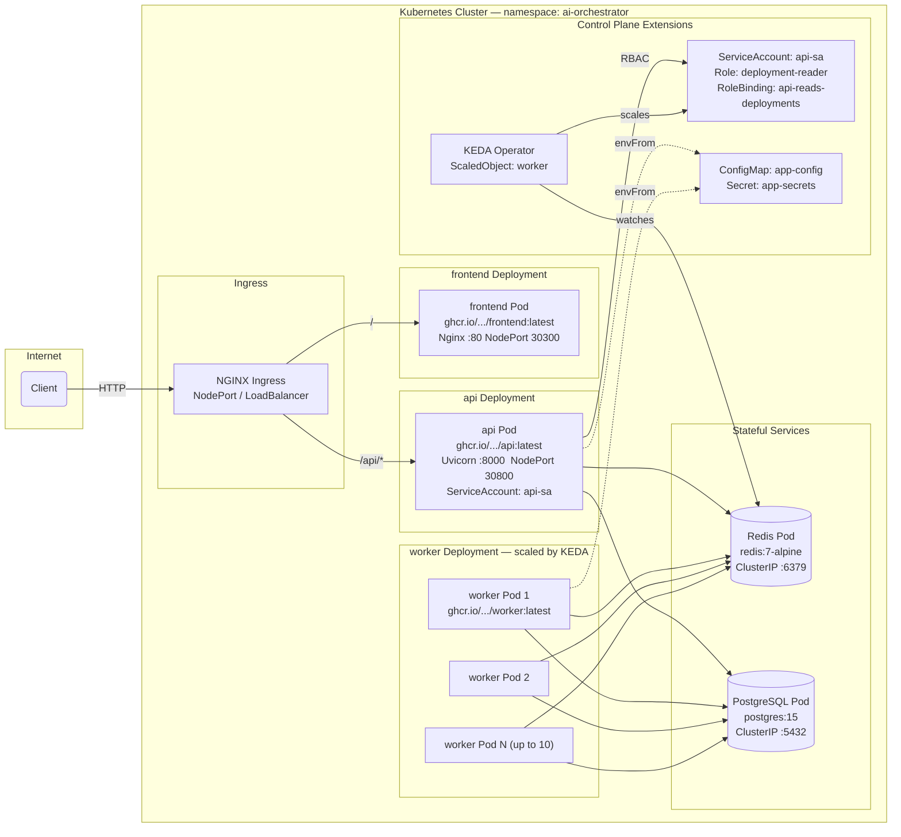

# Distributed AI Task Orchestrator

A production-grade, cloud-native system for **asynchronous AI-powered text analysis at scale**. Tasks are submitted through a REST API, queued in Redis, processed by auto-scaling Celery workers that call the **Groq LLaMA-3.3-70b** model, and persisted in PostgreSQL — all observable in real-time through a React dashboard.

---

## Architecture

### System Overview



---

### Task Status State Machine

Every task transitions through a strict lifecycle. Workers use `SELECT ... FOR UPDATE SKIP LOCKED` to prevent double-processing, and automatically retry transient failures up to three times.



---

### Request & Task Processing Flow

End-to-end sequence from the moment a user submits a task to the moment the result appears in the dashboard.



---

### KEDA Autoscaling Logic

KEDA continuously monitors the Redis task queue depth and drives the Kubernetes `worker` Deployment between 1 and 10 replicas with no custom code required.



---

### Deployment Topology (Kubernetes)

All workloads run in the `ai-orchestrator` namespace. The API reads Deployment status through a scoped RBAC role, enabling live replica counts in the dashboard without cluster-admin privileges.



---

## Technology Stack

| Layer | Technology | Version | Role |
|---|---|---|---|
| **Frontend** | React + Vite | 18 / 5 | Dashboard SPA — queue, health, autoscaling, results |
| **Web Server** | Nginx | Alpine | Serves static assets; proxies `/api/*` to FastAPI |
| **API Framework** | FastAPI | 0.110.0 | REST API server; async-ready with Uvicorn |
| **ASGI Server** | Uvicorn | 0.29.0 | Production ASGI server for FastAPI |
| **Task Queue** | Celery | 5.3.6 | Distributed async task processing |
| **Message Broker** | Redis | 7 | Celery broker, result backend, worker heartbeat |
| **AI Inference** | Groq API | 0.9.0 | LLaMA-3.3-70b-Versatile — text analysis |
| **Database** | PostgreSQL | 15 | Persistent task storage with status lifecycle |
| **ORM** | SQLAlchemy | 2.0.29 | Database access layer |
| **Data Validation** | Pydantic | v2 | Request/response schema validation |
| **K8s Client** | kubernetes | 29.0.0 | In-cluster Deployment status inspection |
| **Autoscaler** | KEDA | v2 | Event-driven autoscaling via Redis queue depth |
| **Ingress** | NGINX Ingress | — | Path-based routing; URL rewriting |
| **Containerization** | Docker | — | Multi-service local dev via Compose |
| **Orchestration** | Kubernetes | — | Production workload management |
| **Image Registry** | GHCR | — | `ghcr.io/moazakramkhan1/...` |

---

## API Reference

### Tasks

| Method | Endpoint | Description |
|---|---|---|
| `POST` | `/api/tasks` | Submit a single task for AI analysis |
| `POST` | `/api/tasks/bulk` | Submit multiple tasks in one request |
| `GET` | `/api/tasks` | List all tasks |
| `GET` | `/api/tasks/{id}` | Get a single task by UUID |

### Metrics

| Method | Endpoint | Description |
|---|---|---|
| `GET` | `/api/metrics/queue` | Queue depth — pending, in_progress, completed, failed |
| `GET` | `/api/metrics/workers` | Worker replica count + scaling status from K8s |
| `GET` | `/api/metrics/results` | Recent completed tasks with AI results |
| `GET` | `/api/metrics/autoscaling/events` | Live autoscaling event snapshot |

### Health

| Method | Endpoint | Description |
|---|---|---|
| `GET` | `/api/health` | Liveness check — database connectivity |
| `GET` | `/api/health/detailed` | Deep health — API, database, Redis, worker heartbeat |

---

## Project Structure

```
.
├── docker-compose.yml          # Local dev: db, redis, api, worker, frontend
├── backend/
│   ├── Dockerfile
│   ├── requirements.txt
│   └── app/
│       ├── main.py             # FastAPI app factory + CORS + lifespan
│       ├── api/routes/
│       │   ├── tasks.py        # Task CRUD + Celery dispatch
│       │   ├── metrics.py      # Queue depth, worker replicas, results
│       │   └── health.py       # Liveness + detailed health check
│       ├── core/
│       │   ├── config.py       # Pydantic Settings — env-driven config
│       │   └── database.py     # SQLAlchemy engine + session factory
│       ├── models/task.py      # SQLAlchemy Task model + TaskStatus enum
│       ├── schemas/task.py     # Pydantic request/response schemas
│       ├── services/
│       │   ├── groq_service.py         # Groq API call + error handling
│       │   ├── task_service.py         # DB queries for Task model
│       │   ├── health_service.py       # Redis ping + heartbeat key
│       │   ├── queue_metrics_service.py # Redis LLEN + scaling status inference
│       │   └── k8s_service.py          # Kubernetes Deployment status via RBAC
│       └── worker/
│           ├── celery_app.py   # Celery application factory
│           └── tasks.py        # process_task — acquire lock, call Groq, persist result
└── frontend/
│   ├── Dockerfile
│   ├── nginx.conf              # Static serving + /api/* proxy pass
│   └── src/
│       ├── App.jsx             # Root component + polling orchestration
│       ├── components/
│       │   ├── StatCard.jsx         # Individual metric tile
│       │   ├── HealthPanel.jsx      # API/DB/Redis/Worker health status
│       │   ├── AutoscalingPanel.jsx # Replica count + scaling state
│       │   └── ResultLog.jsx        # Scrollable completed task results
│       └── services/api.js     # Typed fetch wrappers for all API calls
└── k8s/
    ├── namespace.yaml
    ├── api/
    │   ├── deployment.yaml     # API Deployment + NodePort Service
    │   └── rbac.yaml           # ServiceAccount + Role + RoleBinding
    ├── worker/deployment.yaml  # Worker Deployment (scaled by KEDA)
    ├── frontend/deployment.yaml # Frontend Deployment + NodePort Service
    ├── keda/scaledobject.yaml  # KEDA ScaledObject — Redis trigger
    ├── postgres/postgres.yaml  # PostgreSQL StatefulSet/Deployment
    ├── redis/redis.yaml        # Redis Deployment + ClusterIP Service
    ├── ingress/ingress.yaml    # NGINX Ingress — path rewriting
    └── config/app-config.yaml.example  # ConfigMap + Secret template
```

---

## Local Development (Docker Compose)

### Prerequisites

- Docker Desktop
- A `.env` file in the project root (see below)

### Environment Variables

```env
POSTGRES_USER=orchestrator
POSTGRES_PASSWORD=secret
POSTGRES_DB=orchestrator

DATABASE_URL=postgresql://orchestrator:secret@db:5432/orchestrator
REDIS_URL=redis://redis:6379/0
CELERY_BROKER_URL=redis://redis:6379/0
CELERY_RESULT_BACKEND=redis://redis:6379/0

GROQ_API_KEY=your_groq_api_key_here
GROQ_MODEL=llama-3.3-70b-versatile

SIMULATE_AI_FAILURE=true
WORKER_HEARTBEAT_TTL_SECONDS=30
CELERY_QUEUE_NAME=celery

K8S_NAMESPACE=ai-orchestrator
WORKER_DEPLOYMENT_NAME=worker
WORKER_MIN_REPLICAS=1
WORKER_MAX_REPLICAS=10
```

### Start All Services

```bash
docker compose up --build
```

| Service | URL |
|---|---|
| React Dashboard | http://localhost:3000 |
| FastAPI (Swagger) | http://localhost:8000/docs |
| PostgreSQL | localhost:5432 |
| Redis | localhost:6379 |

---

## Kubernetes Deployment

### Prerequisites

- A running Kubernetes cluster (minikube, kind, or cloud)
- KEDA v2 installed — [keda.sh/docs](https://keda.sh/docs/deploy/)
- NGINX Ingress Controller installed
- Container images pushed to GHCR

### Deploy

```bash
# 1. Create namespace
kubectl apply -f k8s/namespace.yaml

# 2. Create config and secrets (copy and populate the example first)
cp k8s/config/app-config.yaml.example k8s/config/app-config.yaml
kubectl apply -f k8s/config/app-config.yaml

# 3. Deploy stateful services
kubectl apply -f k8s/postgres/
kubectl apply -f k8s/redis/

# 4. Deploy application (API, Worker, Frontend)
kubectl apply -f k8s/api/
kubectl apply -f k8s/worker/
kubectl apply -f k8s/frontend/

# 5. Configure autoscaling
kubectl apply -f k8s/keda/

# 6. Expose via Ingress
kubectl apply -f k8s/ingress/
```

### Verify

```bash
# Watch worker pods scale with queue depth
kubectl get pods -n ai-orchestrator -w

# Check KEDA ScaledObject status
kubectl get scaledobject -n ai-orchestrator

# Submit tasks and observe autoscaling
curl -X POST http://<ingress-ip>/api/tasks \
  -H "Content-Type: application/json" \
  -d '{"input_text": "Analyze this operational alert..."}'
```

---

## Key Design Decisions

| Decision | Rationale |
|---|---|
| **`SELECT ... FOR UPDATE SKIP LOCKED`** | Prevents multiple workers from claiming the same task; eliminates duplicate processing without a distributed lock service |
| **Redis heartbeat key with TTL** | Workers continuously refresh a Redis key; the API treats absence of the key as a degraded worker — no complex health protocol needed |
| **KEDA Redis trigger** | Zero-code autoscaling: KEDA reads `LLEN celery` directly and drives the K8s Deployment — no custom metrics server or HPA adapter needed |
| **RBAC deployment-reader role** | Minimal-privilege K8s access: the API can observe worker replica counts without cluster-admin, enabling live autoscaling data in the dashboard |
| **Celery retry with `with_for_update`** | Tasks retry up to 3 times with exponential-style countdown; the DB is the source of truth for retry count, preventing silent drops |
| **SIMULATE_AI_FAILURE flag** | `FAIL_TEST` keyword in input triggers a controlled failure path, allowing full retry/failure lifecycle testing without breaking the Groq API key |
